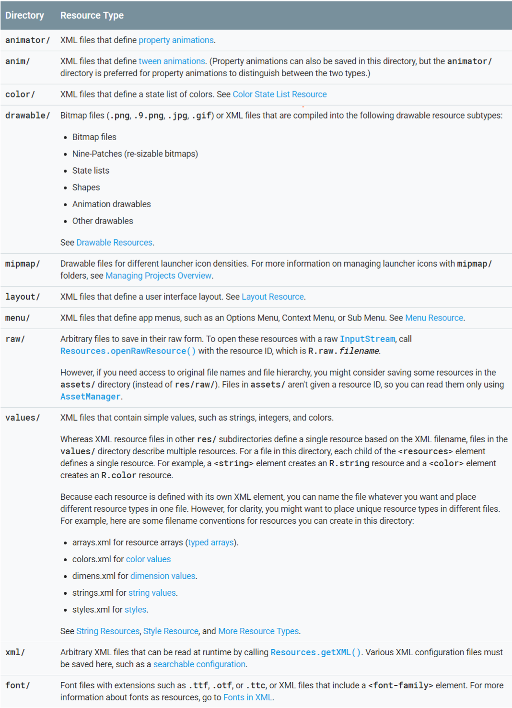

# App Resources #

资源是代码使用的附加文件和静态内容，例如位图，布局定义，用户界面字符串，动画说明等。

我们应该始终将代码中的应用程序资源（如图像和字符串）外部化，以便可以独立维护它们。还应该为特定设备配置提供备用资源，方法是将它们分组到特殊名称的资源目录中。在运行时，Android使用基于当前配置的适当资源。例如，您可能希望根据屏幕尺寸或不同的字符串提供不同的UI布局，具体取决于语言设置。

将应用程序资源外部化后，可以使用项目R类中生成的资源ID访问它们。

## 一：Grouping resource types ##

Android将每种类型的资源放置在项目 res/ 目录的特定子目录中。

