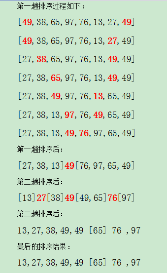
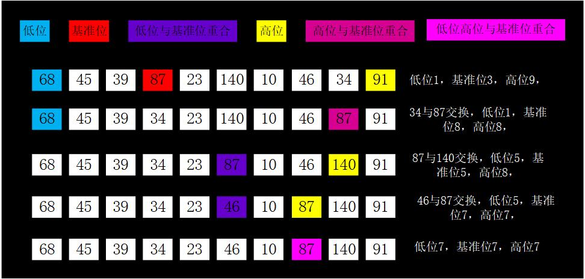

# 快速排序 #

快速排序（Quick Sort 又称partition-exchange sort），是对冒泡排序的一种改进。它的基本思想是，通过一趟排序将待排记录分割成独立的两部分，其中一部分记录的关键字均比另一部分记录的关键字小，则可分别对这两部分记录继续进行排序，以达到整个序列有序。

## 算法设计 ##

### 算法描述 ###

快速排序使用分治法来把一个串（list）分为两个子串（sub-lists）。具体算法描述如下：

- 从数列中挑出一个元素，称为 “基准”（pivot）；

- 重新排序数列，所有元素比基准值小的摆放在基准前面，所有元素比基准值大的摆在基准的后面（相同的数可以到任一边）。在这个分区退出之后，该基准就处于数列的中间位置。这个称为分区（partition）操作；

- 递归地（recursive）把小于基准值元素的子数列和大于基准值元素的子数列排序。

### 算法图示 ###

## 算法实现 ##

快速排序我们代码实现其实主要在于如何分组也即如何实现一趟快速排序，通常的做法是附设两个指针low和high，他们的初始值分别为low和high，设枢轴记录的关键字为pivotkey，则首先从high位置向前搜索找到第一个关键字小于pivotKey的记录和枢轴记录互相交换，然后从low位置起向后搜索，找到第一个关键字大于pivotKey的记录和枢轴记录互相交换，重复这两步，直到low = high为止。

这里有个现象需要注意，我们每次要与枢轴记录交换，但是每交换一次，枢轴记录的下标就会改变。

例如对于序列 { 68，45，39，87，23，140，10， 46， 34， 91}

- 我们选取 87为基准值，下标为3，低位下标为0，高位下标为9；

- 则当我们从高位扫描的时候，91比87大，高位减一， 34比87小，所以此时34 需要与 87 交换，此时交换后的数列为 {68，45，39，34，23，140，10， 46， 87， 91}，基准值下标为8，高位下标为8，低位下标为0，基准值的下标与高位的下标相同；

- 再从低位扫描，68,45,39,34,23都比87小，低位依次增加直到低位为5，值为140，比基准值大，与基准值交换，而基准值下标与高位下标相同，交换后序列为{68，45，39，34，23，87，10， 46，140， 91}，此时基准值下标为5，低位下标为5，高位下标为8, 此时基准值的下标与低位的下标相同

- 从高位扫描，46 比87小，所以46 与 87交换，交换后序列为{68，45，39，34，23，46，10， 87，140， 91}，此时基准值下标为7，高位下标为7，低位下标为5，基准值下标与高位相同。

- 从低位扫描，46,10都比87小，不用交换，此时低位为7，高位为7，基准值为7，第一次排序结果序列为{68，45，39，34，23，46，10， 87，140， 91},基准值87左边的都比87小，基准值右边的都比87大。

如图所示:

从上面所讲来看，我们需要关注有几点：

- 从高位开始扫描还是从低位开始扫描，如果升序排列，把比基准值大的放在基准值右边，比基准值小的放在基准值左边；降序则相反。

-  基准值的选择，以及基准值下标的变化，基准值如果选择为中间某个值，而且从高位开始扫描的时候，基准值下标变化是，初始下标，高位，低位，高位，低位。。。直到高位低位重合。从低位开始扫描的话，基准值下标变化是，初始下标，低位，高位，低位，高位，。。。直到高位低位重合。所以写代码的时候需要把第一次扫描特殊考虑。

- 第一次从高位开始扫描的时候，高位下标不能小于基准下标，所以这里需要考虑扫描方向，第一次基准下标，还有基准值右边全是有序的情况。（如果基准值右边加上基准值以及基准值左边第一个全部有序的话，不特殊考虑也会出错）

### 方法一（此方法纯属理解算法，不推荐，也没测试正确性） ###

这里我们取基数为中间值，从高位开始扫描，则代码如下：

		/**
		 * 快速排序分组操作
		 * 
		 * @param array
		 * @param low
		 * @param high
		 * @return
		 */
		public static int partition_v1(int[] array, int low, int high) {
	
			int pivotIndex = (low + high) / 2; // 基准值下标
			int pivot = array[pivotIndex]; // 基准值
			boolean isFirst = true; // 是否排序第一轮的第一次，如果是第一次的话，需要与基准值交换
									// 如果不是第一次的话，基准值的坐标将会移动到高位，低位一直循环
	
			while (low < high) {
	
				if (isFirst) {
	
					while (low < high && array[high] >= pivot && high >= pivotIndex) {
						high--;
					}
	
					if (high >= pivotIndex && low < high) {
						int temp = array[pivotIndex];
						array[pivotIndex] = array[high];
						array[high] = temp;
						isFirst = false;
					}
	
				} else {
	
					while (low < high && array[high] >= pivot) {
						high--;
					}
	
					int temp = array[low];
					array[low] = array[high];
					array[high] = temp;
				}
	
				while (low < high && array[low] <= pivot) {
					low++;
				}
				int temp1 = array[high];
				array[high] = array[low];
				array[low] = temp1;
	
				isFirst = false;
			}
	
			return low;
		}
	
		public static void quickSort_v1(int[] array, int low, int high) {
			if (low < high) {
				int index = partition_v1(array, low, high);
				quickSort(array, low, index - 1);
				quickSort(array, index + 1, high);
			}
		}

### 方法二 ###

上面方法一纯属为了理解算法，需要考虑的东西特别多，还容易出错，一般没什么必要。

**所以，通常情况下我们可以选择取第一个数为基准值，从高位开始扫描。**

取第一个数为基准值，自然必须从高位开始扫描了，而且第一次的时候基准值左边没有数据，如果右边全部有序的话，直接排序完成了。所以，这个问题也解决了。

取第一个数为基准值则第一次的基准值下标就在低位，然后在高位，低位，高位，低位...,所以基准值的下标第一次特殊情况我们就解决了，不用多余的代码。

代码如下：

	    public static int partition_v2(int[] array, int low, int high) {
		int pivot = array[low];
		while (low < high) {

			while (low < high && array[high] >= pivot) {
				high--;
			}
			int temp = array[low];      // 低位就是基准位 交换基准位与高位的值
			array[low] = array[high];
			array[high] = temp;

			while (low < high && array[low] <= pivot) {
				low++;
			}
			int temp1 = array[high];    // 高位就是基准位，交换低位与高位的值
			array[high] = array[low];
			array[low] = temp1;
		}

		return low;
	}

	public static void quickSort_v2(int[] array, int low, int high) {
		if (low < high) {
			int index = partition(array, low, high);
			quickSort(array, low, index - 1);
			quickSort(array, index + 1, high);
		}
	}

	public static void quickSort_v2_merge(int[] array, int low, int high) {

		if (array == null || array.length <= 1 || low > high) {
			return;
		}

		int i = low;
		int j = high;
		int pivotIndex = low;
		int pivotKey = array[pivotIndex];

		while (i < j) {
			while (i < j && array[j] >= pivotKey) {
				j--;
			}
			int temp = array[pivotIndex];
			array[pivotIndex] = array[j];
			array[j] = temp;

			while (i < j && array[i] <= pivotKey) {
				i++;
			}
			int temp1 = array[pivotIndex];
			array[pivotIndex] = array[j];
			array[j] = temp1;
		}

		quickSort_v2_merge(array, low, i - 1);
		quickSort_v2_merge(array, i + 1, high);
	}

### 方法三 ###

**这个方法是各大教科书的标准方法，也是最推荐的方法。**

上面方法二里的，基准值与当前扫描的高位或者低位交换的那一步，每交换一次需要3次赋值操作，而根据我们上面的分析，实际上对基准值的赋值操作是多余的，基准值会在低位，高位，低位，高位之间一直移动，直到一趟排序结束，低位等于高位的时候，才是基准值正确的位置。

所以可以先记录基准值，只做高位或者低位的赋值操作，直到一趟排序结束的时候再讲基准值赋值在正确的位置上。

代码如下：

    /**
	 * 这个是各大教课书的标准版本
	 * 
	 * 选取第一个数作为基准数，比基准数小的移动到低端，比基准数大的移动到高端
	 * 
	 * 这里有几个需要注意的地方，基准数必须是第一位或者最后一位， 如果基准数是第一位的话，必须先从后向前扫描
	 * 
	 * 反之，如果基准数是最后一位的话，则必须从第一位向后扫描
	 * 
	 * 如果需要从整个序列中选出合适的基准数的话，可以先选出合适的数， 再与第一个或者最后一个交换就可以了
	 * 
	 * 
	 * @param array
	 * @param low
	 * @param high
	 * @return
	 */
	public static int partition(int[] array, int low, int high) {
		int pivot = array[low];
		while (low < high) {

			while (low < high && array[high] >= pivot) {
				high--;
			}
			array[low] = array[high];

			while (low < high && array[low] <= pivot) {
				low++;
			}
			array[high] = array[low];
		}
		array[low] = pivot;

		return low;
	}

	public static void quickSort(int[] array, int low, int high) {
		if (low < high) {
			int index = partition(array, low, high);
			quickSort(array, low, index - 1);
			quickSort(array, index + 1, high);
		}
	}

	/**
	 * 上面两个函数合在一起
	 * 
	 * 取第一个数作为基准数
	 * 
	 * @param array
	 *            待排序列
	 * @param low
	 *            低位
	 * @param high
	 *            高位
	 */
	public static void quickSort_merge(int[] array, int low, int high) {

		if (array == null || array.length <= 1 || low > high) {
			return;
		}

		int i = low;
		int j = high;
		int pivot = array[low]; // 用第一个数作为基准数

		while (i < j) { // 从表的两端交替向中间扫描

			while (i < j && array[j] >= pivot) {
				j--;
			}
			array[i] = array[j]; // 比基准数小的数移动到低端

			while (i < j && array[i] < pivot) {
				i++;
			}
			array[j] = array[i]; // 比基准数大的数移动到高端

		}

		array[i] = pivot; // 将基准数填入正确的位置

		// 对子序列递归调用
		quickSort(array, low, i - 1);
		quickSort(array, i + 1, high);
	}

基准数的选择，直接选择第一个数为基准数的确不是好的选择，如果第一个数是最大或者最小的话，将会影响效率。所以我们可以选择第一个数，中间一个数，最后一个数，取三个数中大小是中间的那个数。然后将这个数与第一个数交换，组成一个新的序列来通过上面的方法排序。

### 方法四 ### 

另外还有一种方法，它在思想上与我们前面所讲的稍微有点不同，它是选取一个基准值，从高位和低位交替扫描，如果高位低于基准值，低位高于基准值，则将他们两个交换。最终，高位等于低位的位置是基准值正确的位置，我们将最开始选取的基准值与最后正确的基准值位置交换即可。

代码如下：

	public static void quickSort_v3(int[] array, int low, int high) {

		if (array == null || array.length <= 1 || low > high) {
			return;
		}

		int i = low;
		int j = high;
		int pivot = array[low];

		while (i < j) {

			while (i < j && array[j] >= pivot) {
				j--;
			}

			while (i < j && array[i] <= pivot) {
				i++;
			}

			if (i < j) {

				int temp = array[i];
				array[i] = array[j];
				array[j] = temp;
			}
		}

		array[low] = array[i];
		array[i] = pivot;

		quickSort(array, low, i - 1);
		quickSort(array, i + 1, high);
	}

	public static void quickSort_v3_mid(int[] array, int low, int high) {

		if (array == null || array.length <= 1 || low > high) {
			return;
		}

		int i = low;
		int j = high;
		int pivot = array[(low + high) / 2];

		while (i < j) {

			while (i < j && array[j] >= pivot) {
				j--;
			}

			while (i < j && array[i] <= pivot) {
				i++;
			}

			if (i < j) {

				int temp = array[i];
				array[i] = array[j];
				array[j] = temp;
			}
		}

		array[(low + high) / 2] = array[i];
		array[i] = pivot;

		quickSort(array, low, i - 1);
		quickSort(array, i + 1, high);
	}

## 算法分析 ##
