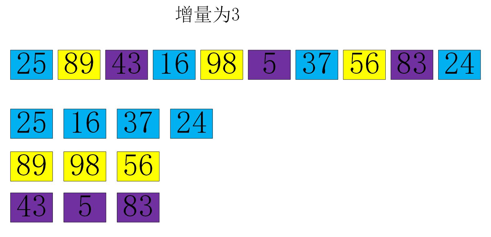

# 希尔排序 #

希尔排序（Shell Sort），又称“缩小增量排序”，是直接插入排序的一种更高效的改进版本。希尔排序是非稳定的算法。

它的基本思想是：先选择一个增量，将整个待排记录序列分割成为若干子序列，再对子序列分别进行直接插入排序。此时，第一次排序已经完成，然后再选择递减的增量，重复以上操作。待整个序列中的记录基本有序时，选择增量为1重复以上操作，即对全体记录进行一次直接插入排序。

## 算法设计 ##

### 算法描述 ###

- 选择一个增量序列 t1,t2,...,ti,tj,...tk,其中ti >tj,tk = 1;
- 按增量序列个数，对序列进行K次排序；
- 每次排序，根据对应的增量ti，将待排序列分割成若干长度为m 的子序列，分别对各子序列进行直接插入排序。仅增量因子为1 时，相当于进行一次直接插入排序。

### 算法图示 ###

### 算法元素 ###

#### 增量序列 ####

增量序列需要满足两个条件，第一增量序列应该是递减的，第二增量序列的最后一个增量应该为1.

增量序列一般有两种类型：

- 一种是不管待排序序列长度为多少，我们的增量序列都是一个固定长度的数组。这种称为固定增量序列。

- 另一种是，增量序列通过待排序数列的长度和递推公式动态生成，这种称为动态增量序列。

增量序列的具体内容可参考 [维基百科英文版](https://en.wikipedia.org/wiki/Shellsort)

#### 子序列 ####

需要注意的是，子序列的构成不是简单的逐段分割，而是将相隔某个增量的记录组成一个子序列，另外这里所说的组成一个子序列只是逻辑上的，并不会去交换它们的位置，只是我们在设计算法的时候把相隔某个增量的一些列记录看做一个子序列。如下图所示，相同颜色的在逻辑上组成一个子序列。

## 算法实现 ##

### Java语言实现 ###

	
	/**
	 * 希尔排序-固定增量序列
	 * 
	 * @param array 待排序序列
	 * @param gaps  增量序列
	 */
	public static void shellSortByConstantGap(int[] array, int[] gaps) {
		
		if (array == null || array.length == 0 || gaps == null || gaps.length == 0) {
			return;
		}

		for (int gap : gaps) {

			for (int i = gap; i < array.length; i++) { // 此处这个判断条件i<array.length，本来应该判断子序列的length
								   // 但是由于这个i如果到了同一个序列的下一个元素的话，那么本轮gap
								   // gap排序应该已经全部完成，所以下面循环里面的temp < array[j]应该
								   // 不会满足，所以这里无所谓
				int temp = array[i];
				int j;

				for (j = i - gap; j >= 0 && temp < array[j]; j = j - gap) {

					array[j + gap] = array[j];
				}
				array[j + gap] = temp;

			}
		}
	}

	/**
	 * 希尔排序-动态增量序列 - 希尔增量序列
	 * 
	 * @param array 待排序序列
	 */
	public static void shellSortByShellGap(int[] array) {
		
		if (array == null || array.length == 0) {
			return;
		}

		int length = array.length;

		for (int gap = length / 2; gap > 0; gap /= 2) {

			for (int i = gap; i < array.length; i++) { // 此处这个判断条件i<array.length，本来应该判断子序列的length
								   // 但是由于这个i如果到了同一个序列的下一个元素的话，那么本轮gap
								   // gap排序应该已经全部完成，所以下面循环里面的temp < array[j]应该
								   // 不会满足，所以这里无所谓
				int temp = array[i];
				int j;

				for (j = i - gap; j >= 0 && temp < array[j]; j = j - gap) {

					array[j + gap] = array[j];
				}
				array[j + gap] = temp;

			}
		}
	}

## 算法分析 ##

## References ##

[https://en.wikipedia.org/wiki/Shellsort](https://en.wikipedia.org/wiki/Shellsort)

